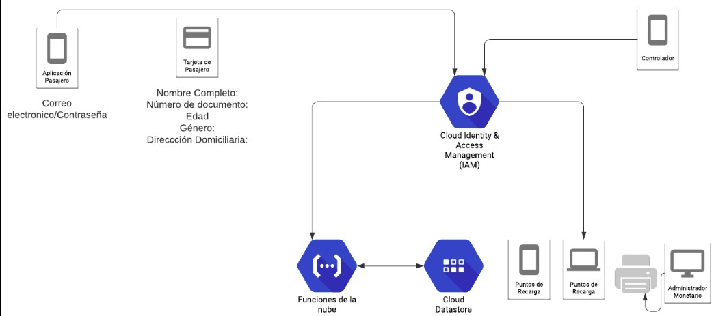

# Transporte Pago - Backend

Es un sistema que permite a los usuarios del transporte público pagar sus pasajes sin el uso de efectivo. Además, contribuye al sistema de salud con una herramienta para agilizar la creación del cerco epidemiológico y al nuevo estilo de vida post cuarentena al que vamos a entrar. La arquitectura propuesta para nuestro sistema se muestra en la Figura  y cuenta con tres aplicaciones principales: 

- [Aplicación Controlador](https://github.com/initgrammers/AppCollector)

- [Aplicación Pasajero](https://github.com/initgrammers/AppPassenger/)

## Capturas

<div align="center">  </div>

## Installación

Para utilizar es necesario tener una cuenta en Firebase. Y activar firebase cloud functions.

```bash
npm install
```

